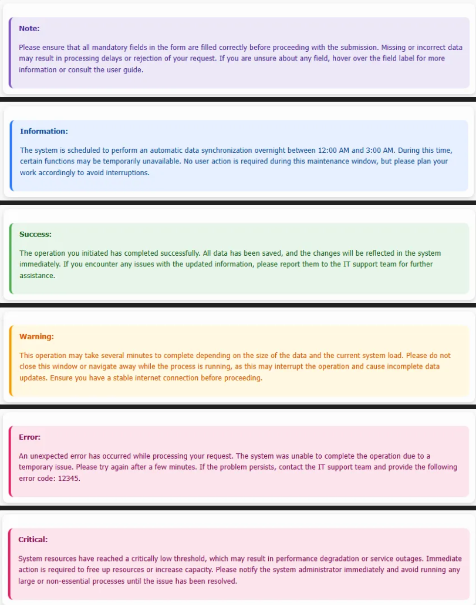
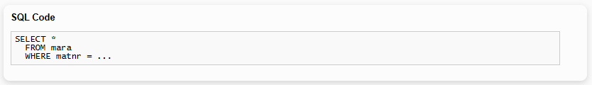

### Button

### Callouts

### Header and Paragraph

### List

### Monospaced Text

### Progress Bar

### Table

<table id="verticalalign">
    <caption>vertical-align</caption>
    <thead>
        <tr>
            <th></th>
            <th>top</th>
            <th>middle</th>
            <th>bottom</th>
            <th>top-right</th>
            <th>middle-right</th>
            <th>bottom-right</th>
        </tr>
    </thead>
    <tbody>
        <tr>
            <td align="left">te st</td>
            <td align="left" valign="top">x</td>
            <td align="left" valign="middle">x</td>
            <td align="left" valign="bottom">x</td>
            <td align="right" valign="top">x</td>
            <td align="right" valign="middle">x</td>
            <td align="right" valign="bottom">x</td>
        </tr>
    </tbody>
</table>

| Example              | Output                                 |
|----------------------|----------------------------------------|
| Button               |         |
| Callouts             |     |
| Header and Paragraph |  |
| List                 |             |
| Monospaced Text      |  |
| Progress Bar         |  |
| Table                |           |
